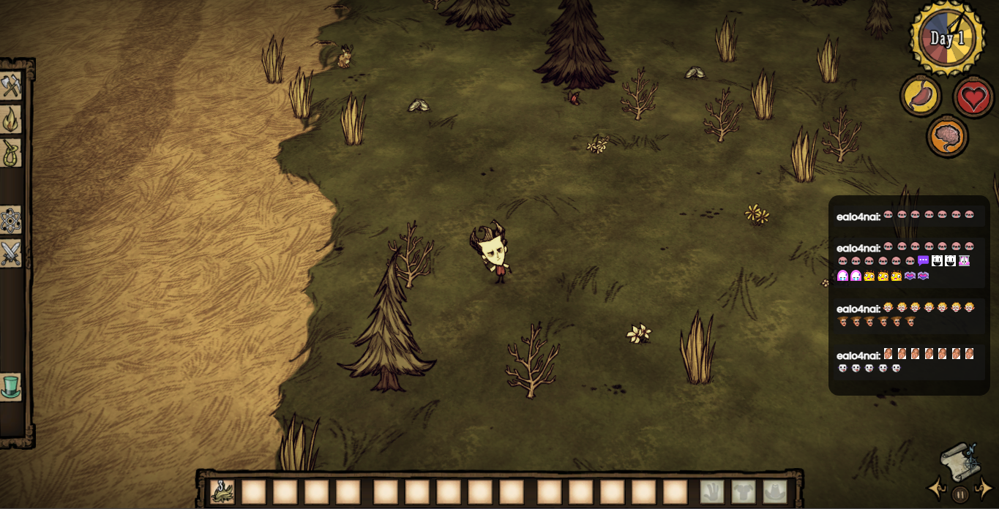

# Rogers chat

This is a simple and minimalist twitch chat overlay inspired on [Transparent Twitch chat overlay](https://github.com/baffler/Transparent-Twitch-Chat-Overlay)

## Overlay settings

In the `build-win32-x64\resources\app\src\settings.json` file you can change some configurations (you can change the root app folder for any name you want).

### Default config
```json
{
  "channel": "penta_grimm",
  "width": 200,
  "height": 300,
  "fontSize": "2.2vw",
  "timeOut": 1200
}

```
IMPORTANT: you need to change your channel name to see your own channel messages, if you do not know css DONT TOUCH font size

### Running the overlay

Once you have set your channel name in settings, run the "build" executable on the folder root (you can rename it)

### features 

- follows current workspaces
- no authentication needed
- simple and fast 
- no app taskbar icon


### Screensots




### What is left ?

- im working on subs messages
- subscriptions might not be possible to show
- im working on a settings modal panel
- time out is not working properly

> Having a problem ? feel free to open an issue.
